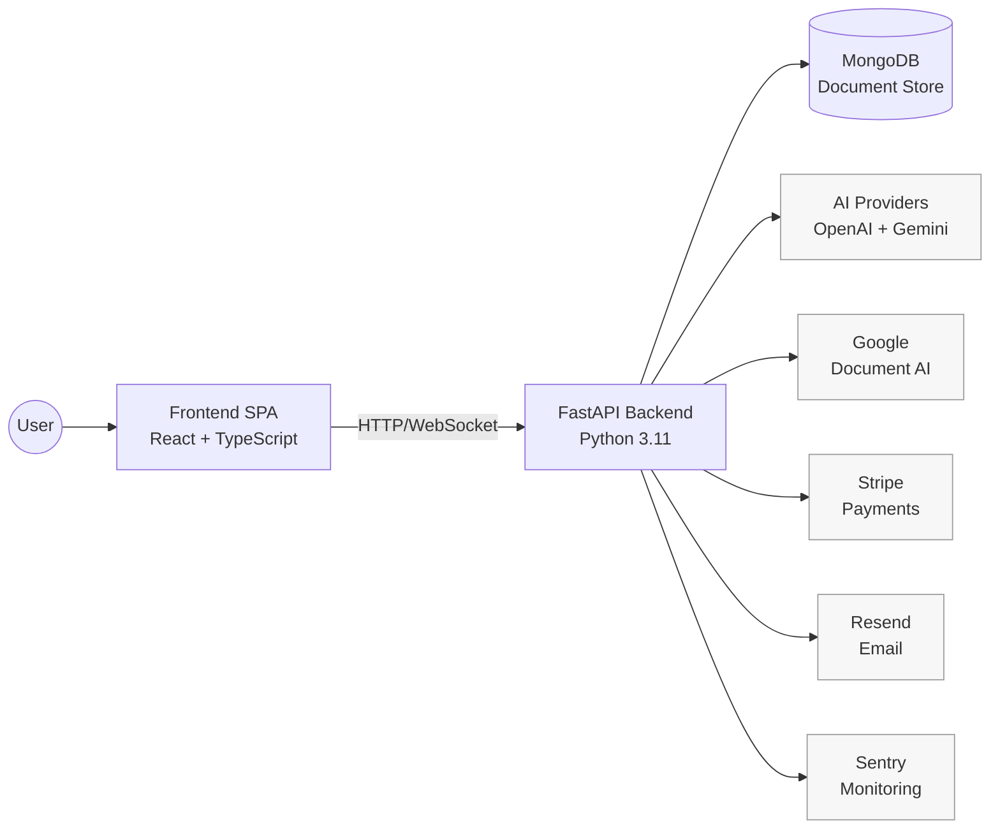
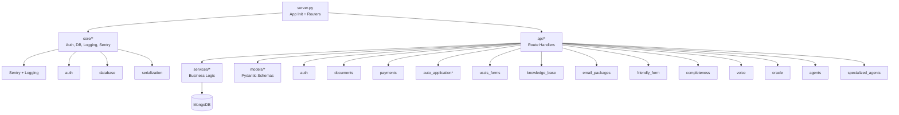
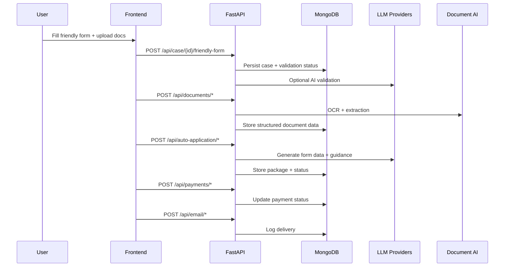
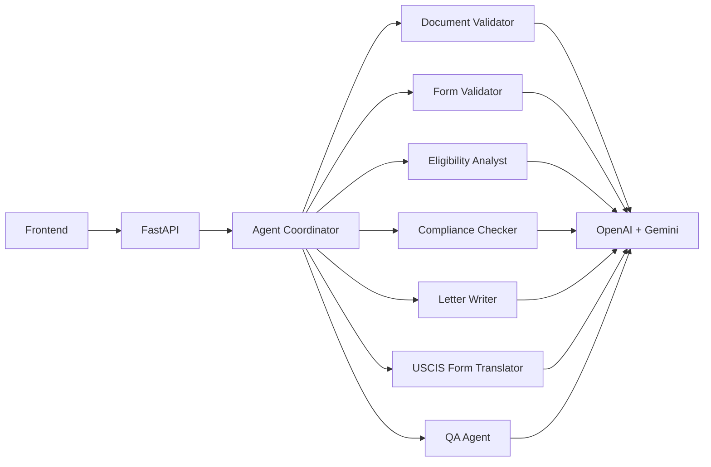

# Osprey Platform - Enterprise Immigration AI System

**Production-ready, multi-agent AI platform for end-to-end immigration case processing**

Osprey is an enterprise-grade B2C immigration platform that combines AI-powered document processing, intelligent form generation, and multi-agent orchestration to streamline the immigration application process. Built with FastAPI, React, and TypeScript, Osprey processes visa applications (B-2, F-1, H-1B, I-130, I-539, EB-2, EB-1A, and more) with unprecedented speed and accuracy.

---

## Table of Contents

- [Executive Overview](#executive-overview)
- [Key Features](#key-features)
- [Technology Stack](#technology-stack)
- [Repository Structure](#repository-structure)
- [Quick Start](#quick-start)
- [Architecture Overview](#architecture-overview)
- [System Components](#system-components)
- [Environment Setup](#environment-setup)
- [Development Workflow](#development-workflow)
- [Deployment](#deployment)
- [API Documentation](#api-documentation)
- [Security & Compliance](#security--compliance)
- [Monitoring & Observability](#monitoring--observability)
- [Troubleshooting](#troubleshooting)
- [Contributing](#contributing)
- [License](#license)

---

## Executive Overview

### Purpose
Osprey transforms the complex immigration application process by:
- **Automating document analysis** via OCR and AI validation
- **Generating USCIS-compliant forms** with intelligent field mapping
- **Orchestrating specialist AI agents** for document validation, eligibility analysis, and QA
- **Providing real-time guidance** through conversational AI assistants
- **Ensuring submission readiness** via professional QA systems

### Target Users
- **Individual Applicants**: Streamlined B-2, F-1, and family-based visa applications
- **Immigration Attorneys**: Document preparation and case management tools
- **Corporate Immigration Teams**: High-volume H-1B, L-1, and EB processing

### Business Value
- **10x Faster Processing**: AI-powered form filling reduces manual work from weeks to hours
- **95%+ Accuracy**: Multi-agent QA ensures USCIS compliance before submission
- **Cost Reduction**: Automates repetitive tasks, reducing paralegal workload by 70%
- **Scalability**: Cloud-native architecture handles 1000+ concurrent cases

---

## Key Features

### 🤖 Multi-Agent AI System
- **Document Validator**: Verifies document authenticity, completeness, and quality
- **Form Validator**: Ensures data completeness and consistency
- **Eligibility Analyst**: Assesses visa eligibility based on user profile
- **Compliance Checker**: Validates USCIS policy and regulation compliance
- **Letter Writer**: Generates compelling cover letters and supporting documents
- **USCIS Translator**: Maps friendly data to official form fields
- **Professional QA Agent**: Final quality assurance before submission

### 📄 Document Processing
- **OCR Integration**: Google Document AI for text extraction
- **Intelligent Classification**: Automatic document type detection (passport, birth certificate, etc.)
- **Field Extraction**: Structured data extraction (names, dates, numbers)
- **Quality Validation**: Image quality, completeness, and fraud detection
- **Multi-format Support**: PDF, JPEG, PNG, TIFF

### 📋 USCIS Form Generation
- **Supported Forms**: I-130, I-539, I-765, I-90, I-485, I-129, I-140, N-400, and more
- **Smart Field Mapping**: User-friendly input → Official USCIS fields
- **PDF Generation**: ReportLab and PyMuPDF for professional output
- **Validation**: Pre-submission checks against USCIS requirements
- **Multi-form Packages**: Coordinated submission packages with supporting docs

### 💳 Payment Processing
- **Stripe Integration**: Secure checkout, subscriptions, webhooks
- **Product Management**: Admin-configurable visa packages and pricing
- **Voucher System**: Discount codes and promotional offers
- **Payment Tracking**: Real-time payment status and history

### 📧 Email & Notifications
- **Resend Integration**: Transactional emails for package delivery
- **Status Updates**: Real-time case progress notifications
- **Document Delivery**: Secure package download links

### 🗣️ Voice & Chat
- **Maria AI Assistant**: Conversational interface for case guidance
- **Voice Transcription**: Google Cloud Speech-to-Text
- **Multi-language Support**: Translation services for global users
- **WebSocket Communication**: Real-time voice interaction

### 👥 Admin Portal
- **User Management**: Admin RBAC with superadmin and admin roles
- **Knowledge Base**: Admin-curated immigration knowledge and policies
- **Product Configuration**: Visa package creation and pricing management
- **Visa Updates**: Track and approve USCIS policy changes
- **Analytics Dashboard**: Case metrics and performance monitoring

---

## Technology Stack

### Backend
- **FastAPI 0.110.1**: High-performance async Python web framework
- **MongoDB 6.0+**: NoSQL database via Motor (async driver)
- **OpenAI GPT-4o**: Primary LLM for reasoning and generation
- **Google Gemini 1.5 Pro**: Multi-modal AI for document analysis
- **Google Document AI**: OCR and structured data extraction
- **Stripe 12.5.1**: Payment processing
- **Resend 2.17.0**: Transactional email
- **Sentry 2.20.0**: Error tracking and performance monitoring
- **PyMuPDF 1.25.3**: PDF manipulation
- **Pydantic 2.11.7**: Data validation

### Frontend
- **React 18.3.1**: UI framework with functional components
- **TypeScript 5.8.3**: Type-safe JavaScript
- **Vite 5.4.19**: Fast build tool and dev server
- **Tailwind CSS 3.4.17**: Utility-first CSS
- **shadcn/ui**: Component library built on Radix UI
- **React Router 7.1.0**: Client-side routing
- **Zustand 5.0.3**: Lightweight state management
- **React Hook Form + Zod**: Form management and validation
- **Stripe Elements**: PCI-compliant payment forms

### Infrastructure
- **Python 3.11+**: Backend runtime
- **Node.js 20+**: Frontend runtime
- **Redis** (optional): Session cache and rate limiting
- **Docker**: Container orchestration
- **Nginx**: Reverse proxy for production

---

## Repository Structure

```
camada-osprey-core/
├── backend/                    # FastAPI backend application
│   ├── server.py              # App initialization, router registration
│   ├── core/                  # Infrastructure (auth, database, logging, sentry)
│   ├── api/                   # API routers (domain-organized endpoints)
│   ├── models/                # Pydantic schemas (request/response models)
│   ├── services/              # Business logic layer
│   ├── policies/              # Immigration policy definitions (YAML)
│   ├── requirements.txt       # Python dependencies
│   ├── .env.example           # Environment template
│   └── README.md             # Backend documentation (1830+ lines)
│
├── frontend/                   # React + Vite frontend application
│   ├── src/
│   │   ├── pages/            # Page components (25+ pages)
│   │   ├── components/       # Reusable UI components (35+ components)
│   │   ├── lib/              # Utilities and API client
│   │   ├── hooks/            # Custom React hooks
│   │   └── App.tsx           # Root component
│   ├── public/               # Static assets
│   ├── index.html            # HTML entry point
│   ├── package.json          # npm dependencies
│   ├── vite.config.ts        # Vite configuration
│   ├── tailwind.config.js    # Tailwind CSS config
│   ├── .env.example          # Environment template
│   └── README.md            # Frontend documentation (1080+ lines)
│
├── immigration_resources/      # Curated knowledge and documents
├── samples/                    # Sample PDFs and test artifacts
├── IMPROVEMENT_PLAN.md        # Backend refactor roadmap
└── README.md                  # This file (root documentation)
```

---

## Quick Start

### Prerequisites

Ensure you have the following installed:

- **Python 3.11+**
- **Node.js 20+** and **npm 10+**
- **MongoDB 6.0+** (local or remote)
- **Git**

### 1. Clone Repository

```bash
git clone <repo-url>
cd camada-osprey-core
```

### 2. Backend Setup

```bash
cd backend

# Create virtual environment
python3 -m venv venv
source venv/bin/activate  # On Windows: venv\Scripts\activate

# Install dependencies
pip install -r requirements.txt

# Configure environment
cp .env.example .env
nano .env  # Add your API keys (MongoDB, OpenAI, Stripe, etc.)

# Start development server
python3 server.py
```

Backend API will be available at:
- **API**: `http://localhost:8001`
- **API Docs**: `http://localhost:8001/docs`

### 3. Frontend Setup

```bash
cd frontend

# Install dependencies
npm install

# Configure environment
cp .env.example .env
nano .env  # Set VITE_API_URL=http://localhost:8001

# Start development server
npm run dev
```

Frontend will be available at:
- **App**: `http://localhost:3000` (or `http://localhost:5173` depending on Vite config)

### 4. Create Admin User

```bash
cd backend
python3 create_admin_user.py
# Follow prompts to create first admin account
```

---

## Architecture Overview

Osprey follows a **modern, decoupled architecture** with clear separation between frontend, backend, and external services.

### High-Level System Flow



### Backend Module Boundaries



### Case Processing Flow



### Agent and AI Orchestration



---

## System Components

### Backend (`backend/`)
**See [backend/README.md](backend/README.md) for comprehensive documentation (1830+ lines)**

**Core Modules**:
- `core/auth.py`: JWT authentication, password hashing
- `core/database.py`: MongoDB lifecycle, schedulers, DBProxy
- `core/logging.py`: Structured logging (JSON/plain)
- `core/serialization.py`: MongoDB-safe response serialization
- `core/sentry.py`: Sentry initialization with full integrations

**API Routers** (domain-organized):
- `api/auth.py`: Login, registration, token validation
- `api/documents.py`: Document upload, OCR, analysis
- `api/auto_application*.py`: Case management, AI processing, packages
- `api/uscis_forms.py`: USCIS form generation and validation
- `api/payments.py`: Stripe integration, webhooks
- `api/email_packages.py`: Email delivery via Resend
- `api/knowledge_base.py`: Admin knowledge management
- `api/specialized_agents.py`: AI agent orchestration
- `api/oracle.py`, `api/voice.py`, `api/completeness.py`: Additional features

**Models**:
- `models/enums.py`: VisaType, USCISForm, DifficultyLevel, etc.
- `models/auto_application.py`: Case schemas
- `models/user.py`: User and admin models

**Services** (business logic):
- `services/cases.py`: Case status, progress tracking
- `services/documents.py`: Document processing logic
- `services/education.py`: Education validation

### Frontend (`frontend/`)
**See [frontend/README.md](frontend/README.md) for comprehensive documentation (1080+ lines)**

**Page Components** (25+ pages):
- `NewHomepage.tsx`: Landing page with visa selection
- `SelectForm.tsx`: Visa form selection with details
- `BasicData.tsx`: Personal data collection
- `CoverLetterModule.tsx`: AI-powered cover letter generation
- `EmbeddedCheckout.tsx`: Stripe payment integration
- `Dashboard.tsx`: User case management
- `AdminPanel.tsx`: Admin portal

**UI Components** (35+ components):
- `ui/button.tsx`, `ui/card.tsx`, `ui/dialog.tsx`: shadcn/ui components
- `ProgressTracker.tsx`: Case progress visualization
- `DocumentUpload.tsx`: Drag-and-drop file upload
- `FormBuilder.tsx`: Dynamic form generation
- `BetaBanner.tsx`: Site-wide announcements

**Utilities**:
- `lib/api.ts`: API client with error handling
- `lib/utils.ts`: Helper functions
- `lib/validation.ts`: Form validation schemas

---

## Environment Setup

### Backend Environment Variables

Create `backend/.env` from `backend/.env.example`:

**Required**:
```bash
# MongoDB
MONGODB_URI=mongodb://localhost:27017
MONGODB_DB=osprey_db

# Authentication
JWT_SECRET=your-super-secret-jwt-key-change-in-production

# AI Providers
OPENAI_API_KEY=sk-...
GEMINI_API_KEY=...
GOOGLE_APPLICATION_CREDENTIALS=/path/to/service-account.json

# Payments
STRIPE_SECRET_KEY=sk_test_...
STRIPE_WEBHOOK_SECRET=whsec_...

# Email
RESEND_API_KEY=re_...
SENDER_EMAIL=noreply@yourdomain.com

# CORS
CORS_ORIGINS=http://localhost:3000
```

**Optional (Production)**:
```bash
# Logging
LOG_LEVEL=INFO
LOG_PRETTY=false
LOG_FORMAT=json

# Sentry
SENTRY_DSN=https://...@sentry.io/...
SENTRY_ENVIRONMENT=production
SENTRY_TRACES_SAMPLE_RATE=0.1
```

**See [backend/.env.example](backend/.env.example) for full list (40+ variables)**

### Frontend Environment Variables

Create `frontend/.env` from `frontend/.env.example`:

```bash
# Backend API URL
VITE_API_URL=http://localhost:8001

# Stripe Publishable Key (for frontend)
VITE_STRIPE_PUBLISHABLE_KEY=pk_test_...
```

---

## Development Workflow

### 1. Feature Development

```bash
# Create feature branch
git checkout -b feature/my-feature

# Backend changes
cd backend
# ... make changes ...
black .  # Format code
flake8 .  # Lint
python3 server.py  # Test locally

# Frontend changes
cd frontend
# ... make changes ...
npm run lint  # Lint
npm run build  # Test build
npm run dev  # Test locally
```

### 2. Testing

**Backend**:
```bash
cd backend
pytest                              # Run all tests
pytest tests/test_auth.py          # Run specific test
pytest --cov=api --cov=core        # Run with coverage
```

**Frontend**:
```bash
cd frontend
npm run test          # Run unit tests (if configured)
npm run lint          # ESLint
npm run type-check    # TypeScript type checking
```

### 3. Code Quality

**Backend**:
- **Formatting**: Black (line length 100)
- **Linting**: Flake8
- **Type Checking**: MyPy
- **Security**: Bandit (for security vulnerabilities)

**Frontend**:
- **Formatting**: Prettier
- **Linting**: ESLint with TypeScript plugin
- **Type Checking**: TypeScript compiler (`tsc --noEmit`)

### 4. Commit Guidelines

Follow [Conventional Commits](https://www.conventionalcommits.org/):

```bash
git commit -m "feat(auth): add OAuth2 support"
git commit -m "fix(payments): resolve Stripe webhook signature validation"
git commit -m "docs(readme): update deployment instructions"
git commit -m "refactor(api): split monolithic router into modules"
```

Types:
- `feat`: New feature
- `fix`: Bug fix
- `docs`: Documentation changes
- `refactor`: Code refactoring
- `test`: Test additions or changes
- `chore`: Build process or tooling changes

---

## Deployment

### Production Checklist

**Security**:
- [ ] Set strong `JWT_SECRET` (64+ random characters)
- [ ] Configure `CORS_ORIGINS` with actual domain (not `*`)
- [ ] Enable HTTPS (use reverse proxy like Nginx)
- [ ] Set up MongoDB authentication and TLS
- [ ] Rotate API keys regularly
- [ ] Enable rate limiting (Redis recommended)

**Backend**:
- [ ] Set `LOG_LEVEL=WARNING` and `LOG_FORMAT=json`
- [ ] Configure `SENTRY_DSN` and `SENTRY_ENVIRONMENT=production`
- [ ] Use MongoDB Atlas or managed MongoDB
- [ ] Set up Stripe webhook endpoint with valid `STRIPE_WEBHOOK_SECRET`
- [ ] Configure Google Cloud credentials securely
- [ ] Set up backup strategy for MongoDB
- [ ] Configure health check endpoint

**Frontend**:
- [ ] Build production bundle: `npm run build`
- [ ] Serve with CDN or static hosting (Vercel, Netlify, Cloudflare)
- [ ] Configure correct `VITE_API_URL` for production
- [ ] Enable asset compression (Gzip, Brotli)
- [ ] Set up monitoring (Sentry, LogRocket)

**Infrastructure**:
- [ ] Set up CI/CD pipeline (GitHub Actions, GitLab CI)
- [ ] Configure database backups (daily automated)
- [ ] Set up monitoring and alerting
- [ ] Load test API endpoints
- [ ] Configure auto-scaling (if using cloud)

### Docker Deployment

**docker-compose.yml** (root directory):
```yaml
version: '3.8'

services:
  backend:
    build: ./backend
    ports:
      - "8001:8001"
    environment:
      - MONGODB_URI=mongodb://mongo:27017
      - MONGODB_DB=osprey_db
    env_file:
      - ./backend/.env
    depends_on:
      - mongo

  frontend:
    build: ./frontend
    ports:
      - "3000:3000"
    environment:
      - VITE_API_URL=http://backend:8001

  mongo:
    image: mongo:6.0
    volumes:
      - mongo-data:/data/db
    ports:
      - "27017:27017"

volumes:
  mongo-data:
```

**Deploy**:
```bash
# Build and start all services
docker-compose up -d

# View logs
docker-compose logs -f backend

# Stop services
docker-compose down
```

### Cloud Deployment

**Backend Options**:
- **AWS**: Elastic Beanstalk, ECS, or EC2
- **Google Cloud**: App Engine, Cloud Run, or GKE
- **Azure**: App Service or Container Instances
- **DigitalOcean**: App Platform or Droplets

**Frontend Options**:
- **Vercel**: Zero-config deployment with preview branches
- **Netlify**: Continuous deployment with form handling
- **Cloudflare Pages**: Fast global CDN
- **AWS S3 + CloudFront**: Custom CDN setup

**Database**:
- **MongoDB Atlas**: Managed MongoDB with auto-scaling
- **AWS DocumentDB**: MongoDB-compatible managed service
- **Google Cloud Firestore**: Alternative NoSQL option

---

## API Documentation

### Interactive Documentation

FastAPI auto-generates interactive API documentation:

- **Swagger UI**: `http://localhost:8001/docs`
- **ReDoc**: `http://localhost:8001/redoc`
- **OpenAPI JSON**: `http://localhost:8001/openapi.json`

### Key Endpoints

**Authentication**:
- `POST /api/login`: User login → JWT token
- `POST /api/register`: User registration
- `POST /api/verify-token`: Validate JWT token

**Cases**:
- `POST /api/auto-application/cases`: Create new case
- `GET /api/auto-application/cases/{case_id}`: Get case details
- `PATCH /api/auto-application/cases/{case_id}`: Update case
- `GET /api/auto-application/cases`: List user's cases

**Documents**:
- `POST /api/documents/upload`: Upload and analyze document
- `GET /api/documents/{doc_id}`: Get document metadata
- `DELETE /api/documents/{doc_id}`: Delete document

**Payments**:
- `POST /api/payments/create-checkout-session`: Create Stripe checkout
- `POST /api/payments/webhook`: Stripe webhook handler

**USCIS Forms**:
- `POST /api/uscis-forms/generate`: Generate filled form PDF
- `GET /api/uscis-forms/{form_code}/fields`: Get form fields

**For complete API reference, see [backend/README.md](backend/README.md#api-modules)**

---

## Security & Compliance

### Authentication & Authorization

**JWT-based Authentication**:
- 30-day token expiration
- Secure password hashing with bcrypt
- HTTP-only cookies (optional)
- Role-based access control (RBAC) for admins

**Admin Roles**:
- `admin`: Standard admin access (read/write)
- `superadmin`: Full access including admin management

### Data Protection

**Encryption**:
- TLS 1.3 for data in transit (production)
- MongoDB encryption at rest (Atlas)
- Encrypted environment variables

**PII Handling**:
- Minimal data collection
- Secure document storage (S3 with encryption)
- GDPR-compliant data deletion
- Audit logging for admin actions

### Security Best Practices

**Input Validation**:
- Pydantic models for API validation
- Input sanitization via `input_sanitizer.py`
- SQL injection prevention (NoSQL database)
- XSS prevention (React auto-escaping)

**Rate Limiting**:
- Per-user request limits
- IP-based rate limiting
- Expensive operation throttling

**Monitoring**:
- Sentry for error tracking
- Failed login attempt tracking
- Suspicious activity alerts

---

## Monitoring & Observability

### Logging

**Backend (Structured JSON)**:
```python
logger.info(
    "Case created successfully",
    extra={
        "case_id": "OSP-ABC123",
        "user_id": "user-uuid",
        "form_code": "I-539"
    }
)
```

**Configuration**:
- `LOG_LEVEL`: DEBUG, INFO, WARNING, ERROR
- `LOG_FORMAT`: plain (development) / json (production)
- `LOG_PRETTY`: true (colorized) / false (plain)

### Sentry Integration

**Features**:
- Automatic error capture
- Performance monitoring
- User session tracking
- Release tracking
- Custom tags and context

**Configuration**:
```bash
SENTRY_DSN=https://...@sentry.io/...
SENTRY_ENVIRONMENT=production
SENTRY_TRACES_SAMPLE_RATE=0.1  # 10% of requests traced
```

### Metrics

**Key Metrics to Track**:
- Case completion rate
- Average processing time
- Document upload success rate
- Payment success rate
- API response times
- Error rates by endpoint
- User retention

---

## Troubleshooting

### Common Issues

#### Backend Won't Start

**Error**: `Database not initialized`
```bash
# Check MongoDB is running
mongosh --eval "db.stats()"

# Verify MONGODB_URI in .env
cat backend/.env | grep MONGODB_URI
```

**Error**: `ModuleNotFoundError`
```bash
# Activate virtual environment
source backend/venv/bin/activate

# Reinstall dependencies
pip install -r backend/requirements.txt
```

#### Frontend Won't Start

**Error**: `EADDRINUSE: address already in use`
```bash
# Find and kill process on port 3000
lsof -i :3000
kill -9 <PID>
```

**Error**: `Cannot find module`
```bash
# Clear cache and reinstall
rm -rf frontend/node_modules
rm frontend/package-lock.json
npm install
```

#### API Errors

**401 Unauthorized**:
- Check JWT token is valid and not expired
- Verify `Authorization: Bearer <token>` header format
- Ensure `JWT_SECRET` matches between backend and token

**404 Not Found**:
- Verify API URL in frontend `.env` matches backend
- Check endpoint exists in API docs (`/docs`)

**500 Internal Server Error**:
- Check backend logs for stack trace
- Verify all required API keys are set
- Check Sentry dashboard for error details

### Debug Mode

**Backend**:
```bash
# Enable debug logging
export LOG_LEVEL=DEBUG
export LOG_PRETTY=true
python3 backend/server.py
```

**Frontend**:
```bash
# Run with verbose output
npm run dev -- --debug
```

---

## Contributing

### Pull Request Process

1. Fork the repository
2. Create a feature branch: `git checkout -b feature/my-feature`
3. Make changes following code style guidelines
4. Add tests for new functionality
5. Run linters and tests
6. Update documentation (READMEs if needed)
7. Commit with descriptive message (Conventional Commits)
8. Push to your fork: `git push origin feature/my-feature`
9. Create a Pull Request with detailed description

### Code Review Checklist

**General**:
- [ ] Code follows project style guidelines
- [ ] Tests added/updated and passing
- [ ] Documentation updated (if needed)
- [ ] No secrets or credentials in code
- [ ] Commit messages follow Conventional Commits

**Backend**:
- [ ] Black formatting applied
- [ ] Flake8 linting passes
- [ ] Type hints added for functions
- [ ] Async/await used correctly
- [ ] Error handling implemented
- [ ] Logging added for key operations

**Frontend**:
- [ ] TypeScript types defined
- [ ] ESLint passes
- [ ] Components properly typed
- [ ] No console.log statements (use proper logging)
- [ ] Accessibility considerations (WCAG AA)

---

## Project Status

### Recent Updates (2026-01-13)

**Backend Refactoring**:
- ✅ Modular architecture: Split `server.py` into `core/`, `api/`, `models/`, `services/`
- ✅ Sentry integration: Full error tracking and performance monitoring
- ✅ Structured logging: JSON logging for production
- ✅ MongoDB lifecycle: Proper startup/shutdown with DBProxy
- ✅ Datetime fixes: Replaced deprecated `utcnow()` with `now(timezone.utc)`

**Frontend Improvements**:
- ✅ Button visibility fixes: Removed global CSS conflicts
- ✅ Stripe PaymentElement: Fixed mounting timing issues
- ✅ Controlled inputs: Fixed React warnings
- ✅ API integration: Fixed `makeApiCall` usage across modules
- ✅ SEO enhancements: Added comprehensive meta tags
- ✅ Enterprise documentation: 1080+ line README

**Documentation**:
- ✅ Backend README: 1830+ lines of comprehensive documentation
- ✅ Frontend README: 1080+ lines with API patterns and troubleshooting
- ✅ Root README: This file with architecture diagrams and quick start

### Roadmap

See [IMPROVEMENT_PLAN.md](IMPROVEMENT_PLAN.md) for detailed refactor roadmap.

**Q1 2026**:
- [ ] Complete backend modularization (remaining endpoints)
- [ ] Add comprehensive test suite (80%+ coverage)
- [ ] Implement Redis caching layer
- [ ] Set up CI/CD pipeline

**Q2 2026**:
- [ ] Add real-time collaboration features
- [ ] Implement document version control
- [ ] Add multi-language support (Spanish, Portuguese)
- [ ] Mobile app (React Native)

---

## Documentation Links

- **Backend Documentation**: [backend/README.md](backend/README.md) - 1830+ lines covering FastAPI, AI agents, database, deployment
- **Frontend Documentation**: [frontend/README.md](frontend/README.md) - 1080+ lines covering React, API integration, components
- **API Documentation**: `http://localhost:8001/docs` (interactive Swagger UI)
- **Improvement Plan**: [IMPROVEMENT_PLAN.md](IMPROVEMENT_PLAN.md) - Backend refactor roadmap

---

## Support

### For Developers

1. Check relevant README:
   - Backend issues → [backend/README.md](backend/README.md)
   - Frontend issues → [frontend/README.md](frontend/README.md)
2. Review [Troubleshooting](#troubleshooting) section above
3. Check API docs at `/docs` endpoint
4. Review Sentry dashboard for production errors

### For Users

1. Contact support team
2. Submit feedback via in-app form
3. Check status page for known issues

---

## License

**Proprietary** - All rights reserved.

This software is proprietary and confidential. Unauthorized copying, modification, distribution, or use of this software, via any medium, is strictly prohibited.

---

## Maintainers

**Osprey Development Team**
- Backend Lead: [Name]
- Frontend Lead: [Name]
- DevOps Lead: [Name]
- AI/ML Lead: [Name]

---

**Last Updated**: 2026-01-13
**Version**: 2.0.0
**Platform Status**: Production-ready with active development

---

## Acknowledgments

Built with:
- [FastAPI](https://fastapi.tiangolo.com/) - Modern, fast web framework
- [React](https://react.dev/) - UI library
- [OpenAI](https://openai.com/) - GPT-4 AI models
- [Google Cloud](https://cloud.google.com/) - Document AI and infrastructure
- [Stripe](https://stripe.com/) - Payment processing
- [shadcn/ui](https://ui.shadcn.com/) - Beautiful UI components
- [MongoDB](https://www.mongodb.com/) - Database
- [Sentry](https://sentry.io/) - Error tracking and monitoring

Special thanks to all contributors and the open-source community.
